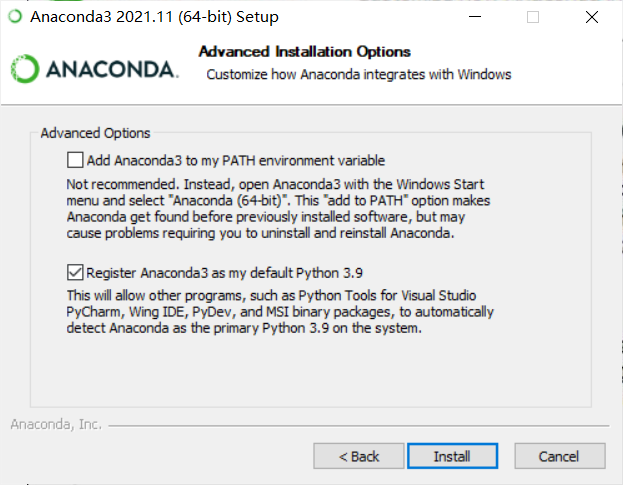
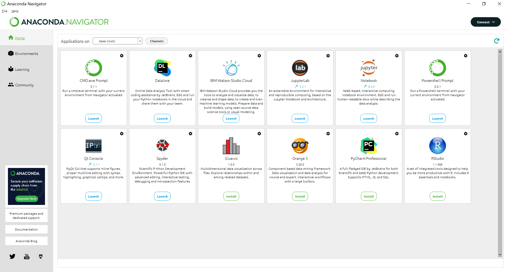
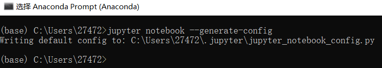
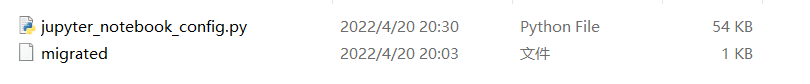
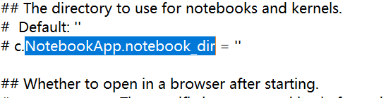
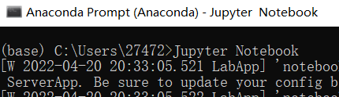
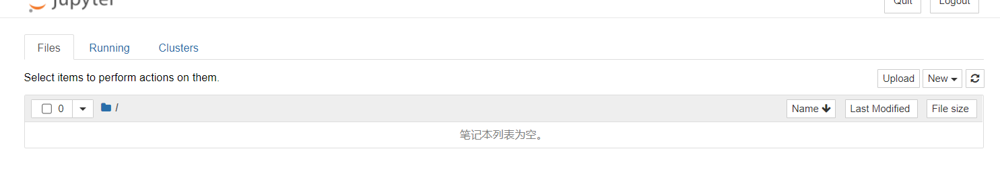
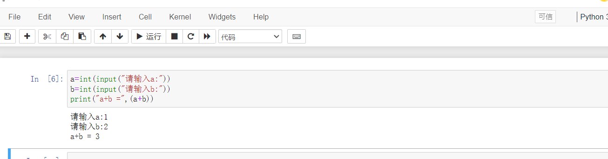

## Anaconda安装

#### Anaconda下载

从https://www.anaconda.com/下载

#### Anaconda安装

注意选项:

#### 运行Anaconda

## Jupyter Notebook的使用

#### 启动Jupyter Notebook

#### 更改默认加载目录

1. 输入`jupyter notebook --generate-config`生成配置文件

  

2. 转到文件夹 C:\Users\27472\.jupyter\

  
3. 编辑jupyter_notebook_config.py，更改c.NotebookApp.notebook_dir

4. 运行Jupyter Notebook

#### 新建一个python文件并运行

